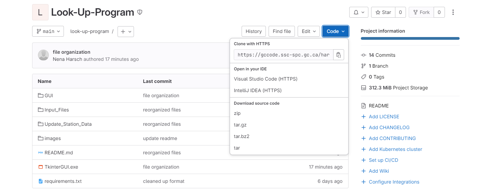
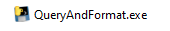
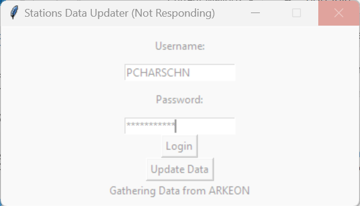
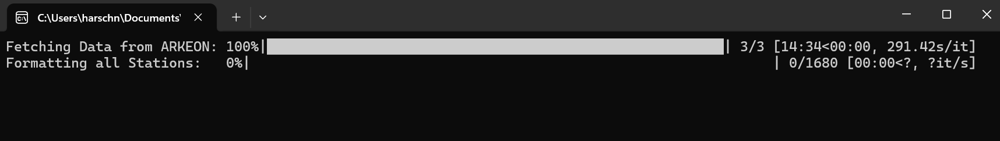
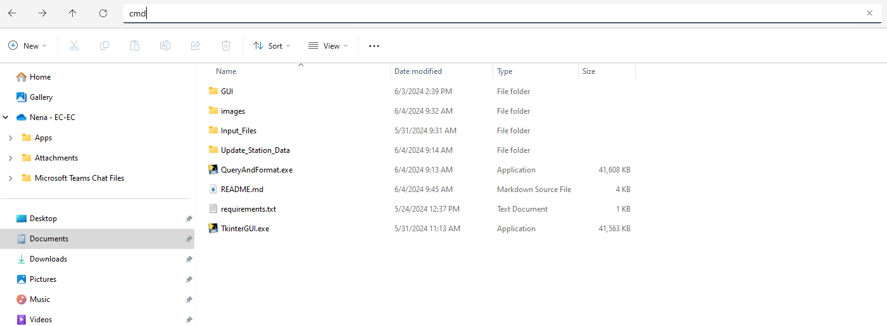

# Lookup-Program
A lookup program with a user-friendly interface that queries the 1971, 1981, and 1991-2020 Public Normals in the Archive for a station/location (STN_ID) and compares the value of each normal/extreme element (Normal ID).

## How to retrieve all the files
- [ ] Go to https://gccode.ssc-spc.gc.ca/harschnena/look-up-program (make sure to login to your GitLab account)
- [ ] Find the blue button "Code" and press on it

- [ ] Download the source code zip
- [ ] Place the extracted folder where you would like the content to be on your device

## Running the Program
### Requirements
Please make sure that StationList.xlsx and stations_data.csv are available in the Input_Files folder.

### How to run the exe file
User can just run the TkinterGUI.exe file by double clicking on the TkinterGUI.exe file: 

### Errors
After each run, there will be an errors.log that will appear in the same directory as your TkinterGUI.exe file. This contains a written account of what errors the program ran into, if any.

## Making Modifications
### Updating stations_data.csv
- [ ] User can just run the QueryAndFormat.exe file by double clicking on the QueryAndFormat.exe file: 
- [ ] User needs to enter their credentials before they can select Update Data (an error message will pop up to prompt the user to login otherwise)
- [ ] When the Update Data button is pressed, the data will start loading and formatting. The interface might show Not Responding and look something like this: 
- [ ] However, when you start QueryAndFormat.exe a terminal will also appear where you can monitor the progress of each step the program is taking: 
- [ ] Once the program finishes, a new csv file called stations_data_new.csv will be available in the Input_Files folder. Make sure to delete the old stations_data.csv and rename the new file to stations_data.csv.

### Updating the code
This will require the user to understand Git and Python.

#### Requirements
- [ ] PortableGit (or Git) installed
    - [ ] To install Git, go to https://git-scm.com/download/win The portable "thumbdrive edition", 64-bit, should not require administrative privileges, it should run directly without requiring installation. If you need to add it to your PATH, open the start menu and type without quotes "edit environment variables for your account", in the window that opens select PATH in the top half of the window (user variables, not system variables), click Edit, click New, and enter the path to the folder containing the Git executable.
- [ ] MUST be on VPN

#### Clone and Configure (using PortableGit)
- [ ] Navigate to your PortableGit folder
- [ ] Double click git-cmd.exe: 
- [ ] Type the following into the terminal
    ```
    >>> git clone https://github.com/nh28/Look-Up-Program
    ```

#### Set Up
- [ ] Still in the terminal, type the following:
```
>>> cd look-up-program
>>> py -3 -m venv venv
>>> cd venv
>>> cd Scripts
>>> activate.bat
>>> # install all the libraries from requirements.txt
>>> pip install -r requirements.txt

```
- [ ] You can make use of pip freeze to see what libraries you have installed in your virtual environment to confirm installation.

```
>>> pip freeze
```

#### How to Run
- [ ] After modifying any files with your choice of editor, you can test run them with Python. Make sure you are still in the virtual environment by seeing (.venv) in front of your command line.
- [ ] Navigate to the correct directory using cd, and then type
```
>>> py {name of py file}
```

#### Recompiling the exe files
To recompile TkinterGUI.exe, make sure pyinstaller is installed and then run
```
>>> pyinstaller TkinterGUI.spec
```
MAKE SURE to use the spec file given, as it makes sure some hidden dependencies are compiled into the exe.
Navigate inside the dist file to find TkinterGUI.exe and move it to the Look-Up-Program folder. You do not need to keep the dist and build folders/ files.

#### Future Uses
For the future, you do not need to open git-cmd.exe, and instead can just open the terminal directly from the folder: 
Then follow set up and how to run.
